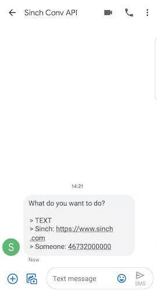
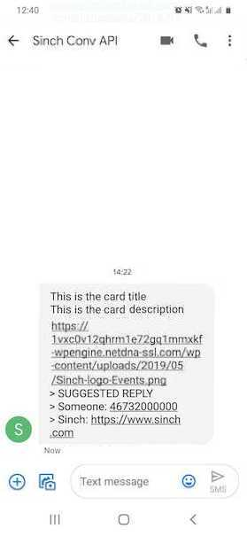
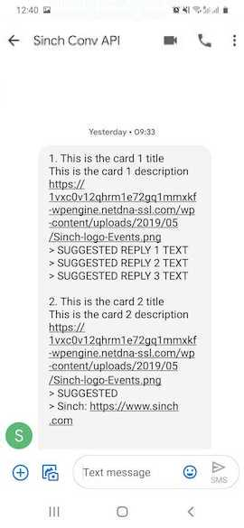

### Conversation API Sinch SMS Support

With Sinch SMS channel you get the largest possible coverage in expense of
limited rich content features.

#### Channel Configuration

##### Sinch SMS service configuration

Sending and receiving SMS messages through Conversation API requires a Sinch SMS service
plan. To ensure the best experience for your end user, we recommend that you set default sender IDs
for your service plan for each country that you have an active user base in.
By default most telecom operators allow end users to send internationally, but to be able to respond to the end user,
often a national registered sender ID must be used. For example, an inbound message from US phone number to
a Swedish long number for the service plan will be passed successfully to the Conversation API **app**
and further to the registered MESSAGE_INBOUND webhooks. However, any outbound messages (replies) to the same US phone number from the
same Conversation API **app** will need to be sent over the US long number registered for the service plan
and not through the Swedish long number. To request domestic long numbers in all relevant countries, please visit Numbers section in [Sinch Portal](https://dashboard.sinch.com/numbers).
Once numbers have been requested, please open a support ticket to request these numbers to be assigned as default originators in their respective countries.

If you want to use a sender that is different from your default originator please refer to [**Channel Specific Properties**](doc:conversation-channel-properties) where you can read about using `SMS_SENDER` property.

##### Conversation API SMS Integration

Once you have your SMS service plan configured according to the above recommendations
you can enable the SMS integration for you Conversation API **app**.
You can either do that in the [Sinch Portal](https://dashboard.sinch.com/convapi/overview)
(recommended) or through the management API. For enabling the SMS channel
through the portal just select your **app** and click on "SET UP CHANNEL" beside the SMS channel.
Then from the drop-down box select your ready configured service plan and
confirm the integration.

###### SMS Integration Using Management API

To setup the SMS integration programmatically you use the management API to
update your app with SMS channel credentials.
The following snippet shows the channel
credentials configuration for **app** with SMS channel:

```json
{
  "channel_credentials": [
    {
      "channel": "SMS",
      "static_bearer": {
        "claimed_identity": "{{SERVICE_PLAN_ID}}",
        "token": "{{API_TOKEN}}"
      }
    }
  ]
}
```

You need to replace `{{SERVICE_PLAN_ID}}` and `{{API_TOKEN}}` with your
Sinch SMS service plan ID and API token.

You also need to configure the callback URL of your service plan to
point to your Conversation API **app**. This step is otherwise done automatically
if the integration is done through the [Sinch Portal](https://dashboard.sinch.com/convapi/overview).
The callback URL is the following:

```
https://xms-adapter.{{REGION}}.conversation-api.int.prod.sinch.com/adapter/v1/{{CONVERSATION_APP_ID}}/callback
```

Where `{{REGION}}` is one of `eu1` or `us1` and must match the region of your **app** while `{{CONVERSATION_APP_ID}}` is the id of your Conversation API **app**.

You also need to configure at least one Conversation API webhook which
will trigger POST callbacks to the given URL.

#### Rich Message Support

This section provides detailed information about which rich messages are
natively supported by SMS channel and what transcoding is applied in
other cases. On a general note, SMS is not considered a rich channel, therefore
many of the message types are transcoded using plaintext.

##### Sending Messages

Here we give a mapping between Conversation API generic message format
and the SMS rendering on mobile devices.
Please note that for the sake of brevity the JSON snippets do not include
the **recipient** and **app_id** which are both required when sending a message.

###### Text Messages

Text messages are natively supported by SMS channel.

---

Conversation API POST `messages:send`

```json
{
  "message": {
    "text_message": {
      "text": "Text message from Sinch Conversation API."
    }
  }
}
```

The rendered message:


###### Media Messages

SMS channel supports Image messages natively.

---

Conversation API POST `messages:send`

```json
{
  "message": {
    "media_message": {
      "url": "https://1vxc0v12qhrm1e72gq1mmxkf-wpengine.netdna-ssl.com/wp-content/uploads/2019/05/Sinch-logo-Events.png"
    }
  }
}
```

The rendered message:


###### Choice Messages

There is no native support for suggested replies or choices in SMS, messages use plaintext.

---

Conversation API POST `messages:send`

```json
{
  "message": {
    "choice_message": {
      "text_message": {
        "text": "What do you want to do?"
      },
      "choices": [
        {
          "text_message": {
            "text": "Text"
          }
        },
        {
          "url_message": {
            "title": "Sinch",
            "url": "https://www.sinch.com"
          }
        },
        {
          "call_message": {
            "title": "Someone",
            "phone_number": "46732000000"
          }
        }
      ]
    }
  }
}
```

The rendered message:



###### Card Messages

There is no native support for cards in SMS, messages use plaintext.

---

Conversation API POST `messages:send`

```json
{
  "message": {
    "card_message": {
      "title": "This is the card title",
      "description": "This is the card description",
      "media_message": {
        "url": "https://1vxc0v12qhrm1e72gq1mmxkf-wpengine.netdna-ssl.com/wp-content/uploads/2019/05/Sinch-logo-Events.png"
      },
      "choices": [
        {
          "text_message": {
            "text": "Suggested Reply"
          }
        },
        {
          "call_message": {
            "title": "Someone",
            "phone_number": "46732000000"
          }
        },
        {
          "url_message": {
            "title": "Sinch",
            "url": "https://www.sinch.com"
          }
        }
      ]
    }
  }
}
```

The rendered message:



###### Carousel Messages

There is no native support for carousels in SMS, messages use plaintext.

---

Conversation API POST `messages:send`

```json
{
  "message": {
    "carousel_message": {
      "cards": [
        {
          "title": "This is the card 1 title",
          "description": "This is the card 1 description",
          "media_message": {
            "url": "https://1vxc0v12qhrm1e72gq1mmxkf-wpengine.netdna-ssl.com/wp-content/uploads/2019/05/Sinch-logo-Events.png"
          },
          "choices": [
            {
              "text_message": {
                "text": "Suggested Reply 1 Text"
              }
            },
            {
              "text_message": {
                "text": "Suggested Reply 2 Text"
              }
            },
            {
              "text_message": {
                "text": "Suggested Reply 3 Text"
              }
            }
          ]
        },
        {
          "title": "This is the card 2 title",
          "description": "This is the card 2 description",
          "media_message": {
            "url": "https://1vxc0v12qhrm1e72gq1mmxkf-wpengine.netdna-ssl.com/wp-content/uploads/2019/05/Sinch-logo-Events.png"
          },
          "choices": [
            {
              "text_message": {
                "text": "Suggested"
              }
            },
            {
              "url_message": {
                "title": "Sinch",
                "url": "https://www.sinch.com"
              }
            }
          ]
        },
        {
          "title": "This is the card 3 title",
          "description": "This is the card 3 description",
          "media_message": {
            "url": "https://1vxc0v12qhrm1e72gq1mmxkf-wpengine.netdna-ssl.com/wp-content/uploads/2019/05/Sinch-logo-Events.png"
          },
          "choices": [
            {
              "call_message": {
                "title": "Someone",
                "phone_number": "46732000000"
              }
            }
          ]
        }
      ]
    }
  }
}
```

The rendered message:



###### Location Messages

SMS supports Location messages natively.

---

Conversation API POST `messages:send`

```json
{
  "message": {
    "location_message": {
      "title": "Location Message",
      "coordinates": {
        "latitude": 55.610479,
        "longitude": 13.002873
      }
    }
  }
}
```

The rendered message:


##### Receiving Messages

SMS support contact initiated messages and choice responses.

Conversation API POST to `MESSAGE_INBOUND` webhook for text message:

```json
{
  "app_id": "01E3S8B6YCMRNR0GGM94H80ACX",
  "accepted_time": "2020-04-24T08:02:50.184581Z",
  "message": {
    "id": "01E6NKBV63YG6K01ENEW7S1N80",
    "direction": "TO_APP",
    "contact_message": {
      "text_message": {
        "text": "Hi from contact"
      }
    },
    "channel": "SMS",
    "conversation_id": "01E6K4A8PGZ6MV0GD3C7M901MZ",
    "contact_id": "01E6K4A8N3NANZ05VM0FS80EHD",
    "metadata": "",
    "accept_time": "2020-04-24T08:02:50.179021Z"
  }
}
```

Conversation API POST to `MESSAGE_INBOUND` webhook for choice response message:

```json
{
  "app_id": "01E3S8B6YCMRNR0GGM94H80ACX",
  "accepted_time": "2020-04-24T08:02:50.184581Z",
  "message": {
    "id": "01E6NKBV63YG6K01ENEW7S1N80",
    "direction": "TO_APP",
    "contact_message": {
      "choice_response_message": {
        "message_id": "01EKJ2SWHGDMYA0F0F1PQJ09WQ",
        "postback_data": "postback"
      }
    },
    "channel": "SMS",
    "conversation_id": "01E6K4A8PGZ6MV0GD3C7M901MZ",
    "contact_id": "01E6K4A8N3NANZ05VM0FS80EHD",
    "metadata": "",
    "accept_time": "2020-04-24T08:02:50.179021Z"
  }
}
```

##### Receiving Delivery Receipts

Messages sent on SMS channel have two statuses: DELIVERED and FAILED.
Below is an example for DELIVERED receipt - FAILED differ by the
`status` and `reason` only.
Conversation API POST to `MESSAGE_DELIVERY` webhook:

```json
{
  "app_id": "01E3S8B6YCMRNR0GGM94H80ACX",
  "accepted_time": "2020-04-23T09:55:04.766Z",
  "message_delivery_report": {
    "message_id": "01E6K7CMXY3KHH0AGCTY6D04F2",
    "conversation_id": "01E6JY5HMCADX31SANQ0YE0CH6",
    "status": "DELIVERED",
    "channel": "SMS",
    "reason": "",
    "metadata": ""
  }
}
```
