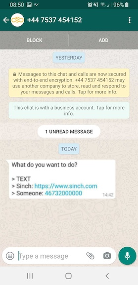
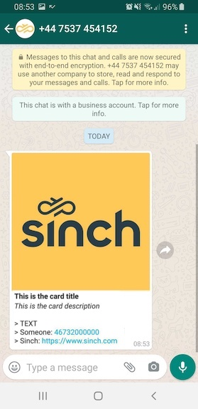
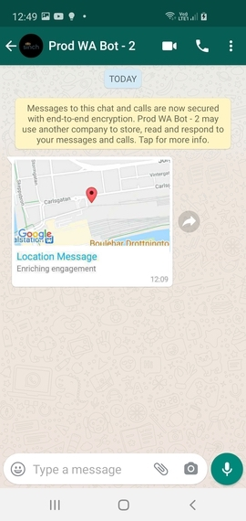

### Conversation API WhatsApp Support

Conversation API provides support for WhatsApp channel through Sinch WhatsApp Business Messaging API. To start using WhatsApp through Conversation API you need to first have a Sinch WhatsApp bot - [read more](https://developers.sinch.com/docs/whatsapp-introduction).

#### Channel Configuration

The easiest way to configure your Conversation API **app** with WhatsApp support is to use [Sinch Portal](https://dashboard.sinch.com/convapi/overview). Just select your **app** and click on "SET UP CHANNEL" beside the WhatsApp channel.

##### Setup WhatsApp integration using the API

Sending a WhatsApp message requires a Conversation API **app** with `channel_credentials` for WHATSAPP channel. Example **app** is given in the following snippet:

```json
{
  "channel_credentials": [
    {
      "channel": "WHATSAPP",
      "static_bearer": {
        "claimed_identity": "{{WHATSAPP_BOT_ID}}",
        "token": "{{WHATSAPP_BEARER_TOKEN}}"
      }
    }
  ]
}
```

You need to replace `{{WHATSAPP_BOT_ID}}` with your Sinch WhatsApp bot ID and `{{WHATSAPP_BEARER_TOKEN}}` with the bot's access token.

Receiving contact messages (replies) and delivery receipts from WhatsApp requires setting the Callback URL of the WhatsApp bot to point to your Conversation API **app**. This step is done automatically if the integration is enabled from the [Sinch Portal](https://dashboard.sinch.com/convapi/overview).

The URL is the following:

```
https://whatsapp-adapter.{{REGION}}.conversation-api.int.prod.sinch.com/adapter/v1/{{CONVERSATION_APP_ID}}/callback
```

Where `{{REGION}}` is one of `eu1` or `us1` and must match the region of your **app** while `{{CONVERSATION_APP_ID}}` is the id of your Conversation API **app**.

Do not forget that for receiving messages you also need to configure at least one Conversation API webhook which will trigger POST callbacks to the given URL. The most important triggers for your conversation applications are:

- MESSAGE_DELIVERY - delivery receipts for business messages
- MESSAGE_INBOUND - inbound messages e.g., contact replies

#### Rich Message Support

Conversation API supports all capabilities of WhatsApp API: rich template messages, media and location messages.

##### Sending Messages

All business initiated conversations on the WhatsApp channel must start with an “Opt-In” by the user. This can be collected through any third party channel. For example in an SMS message, a web form, email etc.

You need to register the collected user opt-in by invoking the opt-in service provided by Conversation API - `/optins:register`. A successful registration or opt-in errors will be announced by a callback to webhooks with trigger `OPT_IN`.

Businesses must also provide a method by which customers may opt-out of receiving future messages from your organization. Registering the user opt-out is done through the Conversation API `/optouts:register` endpoint. The outcome of the opt-out registration is delivered by a callback to webhooks with trigger `OPT_OUT`.

An example payload for opt-in/out registration (POST to `/optins:register` or `/optouts:register`) is provided in the following snippet:

```json
{
  "app_id": "{{APP_ID}}",
  "recipient": {
    "contact_id": "{{CONTACT_ID}}"
  },
  "channels": ["WHATSAPP"]
}
```

where {{APP_ID}} is the ID of your **app** and the {{CONTACT_ID}} is the contact with WhatsApp channel identity for which this opt-in/out is preformed.

The rest of this section provides examples of various messaging capabilities of WhatsApp channel, and how to utilize them using Conversation API generic message format. Please note that for the sake of brevity the JSON snippets do not include the **recipient** and **app_id** which are both required when sending a message.

###### Template messages

Sending a message outside of the customer care session requires an approved template ([read more](https://developers.sinch.com/docs/whatsapp-introduction)). You need to specify the template name, language code, and the set of parameters defined in the template. Conversation API provides capability to send channel-specific templates that use a key-value dictionary to specify the template parameters. Each key in the dictionary corresponds to a property of a template parameter as they are defined in WhatsApp public documentation for [media](https://developers.facebook.com/docs/whatsapp/api/messages/message-templates/media-message-templates) and [interactive](https://developers.facebook.com/docs/whatsapp/api/messages/message-templates/interactive-message-templates) templates.

The format of the keys in the parameter dictionary is of the following form:

```
<component_type>[<component_index>]<component_sub_type>[<parameter_index>]<parameter_field>
```

where:

- _component_type_ is one of header, body or button.
- _component_index_ is a 0-based index of the button in the template. There are at most 3 buttons. _component_index_ is present and required only for button component.
- _component_sub_type_ is present and required only for button component. It is one of quick_reply or url.
- _parameter_index_ is a 1-based index of the parameter for the given component.
- _parameter_field_ is a property of the parameter. It can be one of text, payload, document._, image._ or video.\*

---

**Text Template**

Below is an example of sending a text-only template with three body parameters i.e., no header. The template name is _text_template_ and it is available for _en_ language code.

Conversation API POST `messages:send`

```json
{
  "message": {
    "template_message": {
      "channel_template": {
        "WHATSAPP": {
          "template_id": "text_template",
          "language_code": "en",
          "parameters": {
            "body[1]text": "Value of first parameter",
            "body[2]text": "Value of second parameter",
            "body[3]text": "Value of third parameter"
          }
        }
      }
    }
  }
}
```

Sending the same template for _fr_ language code which also include a text header parameter will be:

```json
{
  "message": {
    "template_message": {
      "channel_template": {
        "WHATSAPP": {
          "template_id": "text_template",
          "language_code": "fr",
          "parameters": {
            "header[1]text": "Value of header parameter",
            "body[1]text": "Value of first parameter",
            "body[2]text": "Value of second parameter",
            "body[3]text": "Value of third parameter"
          }
        }
      }
    }
  }
}
```

---

**Media Template**

WhatsApp allows sending media (document, video, image) in the template header.

**Document**

The parameter fields are:

| Parameter field key             | Description                               | Required? |
| ------------------------------- | ----------------------------------------- | --------- |
| header[1]document.link          | The URL of the document                   | Yes       |
| header[1]document.provider.name | Provider to use when downloading the file | No        |
| header[1]document.filename      | The filename of the document              | No        |

Below is an example of sending a template with a document header and a single body parameter.

The template name is _document_template_ available for _en_ language code.

Conversation API POST `messages:send`

```json
{
  "message": {
    "template_message": {
      "channel_template": {
        "WHATSAPP": {
          "template_id": "document_template",
          "language_code": "en",
          "parameters": {
            "header[1]document.link": "https://example.com/document.pdf",
            "header[1]document.filename": "document.pdf",
            "body[1]text": "Value of first parameter"
          }
        }
      }
    }
  }
}
```

**Video**

The parameter fields are:

| Parameter field key          | Description                               | Required? |
| ---------------------------- | ----------------------------------------- | --------- |
| header[1]video.link          | The URL of the video                      | Yes       |
| header[1]video.provider.name | Provider to use when downloading the file | No        |

Below is an example of sending a template with a video header and a single body parameter.

The template name is _video_template_ available for _en_ language code.

Conversation API POST `messages:send`

```json
{
  "message": {
    "template_message": {
      "channel_template": {
        "WHATSAPP": {
          "template_id": "video_template",
          "language_code": "en",
          "parameters": {
            "header[1]video.link": "https://example.com/video.mp4",
            "body[1]text": "Value of first parameter"
          }
        }
      }
    }
  }
}
```

**Image**

The parameter fields are:

| Parameter field key          | Description                               | Required? |
| ---------------------------- | ----------------------------------------- | --------- |
| header[1]image.link          | The URL of the image                      | Yes       |
| header[1]image.provider.name | Provider to use when downloading the file | No        |

Below is an example of sending a template with an image header and a single body parameter.

The template name is _image_template_ available for _en_ language code.

Conversation API POST `messages:send`

```json
{
  "message": {
    "template_message": {
      "channel_template": {
        "WHATSAPP": {
          "template_id": "image_template",
          "language_code": "en",
          "parameters": {
            "header[1]image.link": "https://example.com/image.jpg",
            "body[1]text": "Value of first parameter"
          }
        }
      }
    }
  }
}
```

---

**Interactive Template**

WhatsApp offers two types of predefined buttons

- _Quick Reply_ - Presents a button with a predefined text which then returns a callback with a defined payload when clicked
- _Call-to-Action_ - Presents a clickable action in WhatsApp to either call a phone number or to visit a website

These buttons can be attached to text or media templates. However you are only allowed to register templates that has at most one of the types, i.e. you can not have a registered template that has both call-to-action and quick reply buttons.

When using quick reply buttons in your templates you can have at most three buttons and while using call-to-action buttons you can have at most two buttons.

The parameter fields used to configure the buttons in the template are:

| Parameter field key            | Description                           | Required?                                         |
| ------------------------------ | ------------------------------------- | ------------------------------------------------- |
| button[n]url[1]text            | Dynamic URL suffix for the URL button | Yes, if button at index _n_ is URL button         |
| button[m]quick_reply[1]payload | Postback payload to be returned       | Yes, if button at index _m_ is quick_reply button |

where _n_ and _m_ are indices of the buttons in the template.

The quick_reply payload field must be set even when empty. For example for quick_reply button at index 0 this can be done by adding the following entry in the parameter dictionary:

```
   "button[0]quick_reply[1]payload": ""
```

Below is an example of sending a template with three quick reply buttons. The template also have one header and one body parameter.

The template name is _interactive_template_quick_reply_ available for _en_ language code.

Conversation API POST `messages:send`

```json
{
  "message": {
    "template_message": {
      "channel_template": {
        "WHATSAPP": {
          "template_id": "interactive_template_quick_reply",
          "language_code": "en",
          "parameters": {
            "header[1]text": "Value of header parameter",
            "body[1]text": "Value of first parameter",
            "button[0]quick_reply[1]payload": "button0clicked",
            "button[1]quick_reply[1]payload": "button1clicked",
            "button[2]quick_reply[1]payload": "button2clicked"
          }
        }
      }
    }
  }
}
```

Below is an example of sending a template with two visit URL buttons (call-to-action). The template also have one header and one body parameter.

The template name is _interactive_template_call_to_action_ available for _en_ language code.

Conversation API POST `messages:send`

```json
{
  "message": {
    "template_message": {
      "channel_template": {
        "WHATSAPP": {
          "template_id": "interactive_template_call_to_action",
          "language_code": "en",
          "parameters": {
            "header[1]text": "Value of header parameter",
            "body[1]text": "Value of first parameter",
            "button[0]url[1]text": "Value for URL suffix button 1",
            "button[1]url[1]text": "Value for URL suffix button 2"
          }
        }
      }
    }
  }
}
```

###### Text Messages

Given a customer care session has started sending a text message with WhatsApp is done as follow:

---

Conversation API POST `messages:send`

```json
{
  "message": {
    "text_message": {
      "text": "Text message from Sinch Conversation API."
    }
  }
}
```

The rendered message:


###### Media Messages

Sending media messages is easy - simply specify the URL to the media and
Conversation API will automatically detect what type of WhatsApp message to use - image, video, document or audio:

---

Conversation API POST `messages:send`

```json
{
  "message": {
    "media_message": {
      "url": "https://1vxc0v12qhrm1e72gq1mmxkf-wpengine.netdna-ssl.com/wp-content/uploads/2019/05/Sinch-logo-Events.png"
    }
  }
}
```

The rendered message:


---

###### Choice Messages

WhatsApp channel does not provide native support for **Choice Messages** so they are
transcoded to text:

---

Conversation API POST `messages:send`

```json
{
  "message": {
    "choice_message": {
      "text_message": {
        "text": "What do you want to do?"
      },
      "choices": [
        {
          "text_message": {
            "text": "Suggested Reply Text"
          }
        },
        {
          "url_message": {
            "title": "URL Choice Message:",
            "url": "https://www.sinch.com"
          }
        },
        {
          "call_message": {
            "title": "Call Choice Message:Q",
            "phone_number": "46732000000"
          }
        }
      ]
    }
  }
}
```

The rendered message:



###### Card Messages

Card messages sent to WhatsApp are transcoded as media with text caption:

---

Conversation API POST `messages:send`

```json
{
  "message": {
    "card_message": {
      "title": "This is the card title",
      "description": "This is the card description",
      "media_message": {
        "url": "https://1vxc0v12qhrm1e72gq1mmxkf-wpengine.netdna-ssl.com/wp-content/uploads/2019/05/Sinch-logo-Events.png"
      },
      "choices": [
        {
          "text_message": {
            "text": "Suggested Reply Text"
          }
        }
      ]
    }
  }
}
```

The rendered message:



###### Carousel Messages

WhatsApp does not support natively Carousel messages and this is why they are
transcoded and sent as text message by Conversation API.

---

Conversation API POST `messages:send`

```json
{
  "message": {
    "carousel_message": {
      "cards": [
        {
          "title": "This is the card 1 title",
          "description": "This is the card 1 description",
          "media_message": {
            "url": "https://1vxc0v12qhrm1e72gq1mmxkf-wpengine.netdna-ssl.com/wp-content/uploads/2019/05/Sinch-logo-Events.png"
          },
          "choices": [
            {
              "text_message": {
                "text": "Suggested Reply 1 Text"
              }
            },
            {
              "text_message": {
                "text": "Suggested Reply 2 Text"
              }
            },
            {
              "text_message": {
                "text": "Suggested Reply 3 Text"
              }
            }
          ]
        },
        {
          "title": "This is the card 2 title",
          "description": "This is the card 2 description",
          "media_message": {
            "url": "https://1vxc0v12qhrm1e72gq1mmxkf-wpengine.netdna-ssl.com/wp-content/uploads/2019/05/Sinch-logo-Events.png"
          },
          "choices": [
            {
              "url_message": {
                "title": "URL Choice Message:",
                "url": "https://www.sinch.com"
              }
            }
          ]
        },
        {
          "title": "This is the card 3 title",
          "description": "This is the card 3 description",
          "media_message": {
            "url": "https://1vxc0v12qhrm1e72gq1mmxkf-wpengine.netdna-ssl.com/wp-content/uploads/2019/05/Sinch-logo-Events.png"
          },
          "choices": [
            {
              "call_message": {
                "title": "Call Choice Message:Q",
                "phone_number": "46732000000"
              }
            }
          ]
        },
        {
          "title": "This is the card 4 title",
          "description": "This is the card 4 description",
          "media_message": {
            "url": "https://1vxc0v12qhrm1e72gq1mmxkf-wpengine.netdna-ssl.com/wp-content/uploads/2019/05/Sinch-logo-Events.png"
          },
          "choices": [
            {
              "location_message": {
                "title": "Location Choice Message",
                "label": "Enriching Engagement",
                "coordinates": {
                  "latitude": 55.610479,
                  "longitude": 13.002873
                }
              }
            }
          ]
        }
      ]
    }
  }
}
```

The rendered message:


###### Location Messages

Location messages are supported by WhatsApp channel:

---

Conversation API POST `messages:send`

```json
{
  "message": {
    "location_message": {
      "title": "Location Message",
      "label": "Enriching Engagement",
      "coordinates": {
        "latitude": 55.610479,
        "longitude": 13.002873
      }
    }
  }
}
```

The rendered message:



##### Receiving Messages

WhatsApp channel supports various kinds of contact messages - text, media, media card, location and quick replies.
All of these are delivered by Conversation API with POST to `MESSAGE_INBOUND` webhook:

---

Example text reply:

```json
{
  "app_id": "01E8RCZPK7HFV70FFDWFFK0EXK",
  "accepted_time": "2020-06-22T10:55:39.534687Z",
  "message": {
    "id": "01EBDTPPG3Q3EH14H7DY8X09MG",
    "direction": "TO_APP",
    "contact_message": {
      "text_message": {
        "text": "Hi from contact"
      }
    },
    "channel_identity": {
      "channel": "WHATSAPP",
      "identity": "46712312312",
      "app_id": ""
    },
    "conversation_id": "01EB199XQ2CBY50K6WZD9S1A22",
    "contact_id": "01EB197NDA4W7V15NPRCVV0S79",
    "metadata": "",
    "accept_time": "2020-06-22T10:55:39.521500Z"
  }
}
```

---

Example media message:

```json
{
  "app_id": "01EB37HMH1M6SV18ASNS3G135H",
  "accepted_time": "2020-10-01T12:10:55.073703Z",
  "event_time": "2020-10-01T12:10:53.991Z",
  "project_id": "c36f3d3d-1513-4edd-ae42-11995557ff61",
  "message": {
    "id": "01EKJ1534NWK5R02TGWEJN13HA",
    "direction": "TO_APP",
    "contact_message": {
      "media_message": {
        "url": "https://1vxc0v12qhrm1e72gq1mmxkf-wpengine.netdna-ssl.com/wp-content/uploads/2019/05/Sinch-logo-Events.png"
      }
    },
    "channel_identity": {
      "channel": "WHATSAPP",
      "identity": "46712312312",
      "app_id": ""
    },
    "conversation_id": "01EKJ0KSWXMVDF05MG9TQ20S06",
    "contact_id": "01EKA07N79THJ20WSN6AS30TMW",
    "metadata": "",
    "accept_time": "2020-10-01T12:10:55.060170Z"
  }
}
```

---

Example media card message:

```json
{
  "app_id": "01EB37HMH1M6SV18ASNS3G135H",
  "accepted_time": "2020-10-01T12:10:55.073703Z",
  "event_time": "2020-10-01T12:10:53.991Z",
  "project_id": "c36f3d3d-1513-4edd-ae42-11995557ff61",
  "message": {
    "id": "01EKJ1534NWK5R02TGWEJN13HA",
    "direction": "TO_APP",
    "contact_message": {
      "media_card_message": {
        "url": "https://1vxc0v12qhrm1e72gq1mmxkf-wpengine.netdna-ssl.com/wp-content/uploads/2019/05/Sinch-logo-Events.png",
        "caption": "caption text"
      }
    },
    "channel_identity": {
      "channel": "WHATSAPP",
      "identity": "46712312312",
      "app_id": ""
    },
    "conversation_id": "01EKJ0KSWXMVDF05MG9TQ20S06",
    "contact_id": "01EKA07N79THJ20WSN6AS30TMW",
    "metadata": "",
    "accept_time": "2020-10-01T12:10:55.060170Z"
  }
}
```

---

Example location contact message:

```json
{
  "app_id": "01E8RCZPK7HFV70FFDWFFK0EXK",
  "accepted_time": "2020-06-22T10:57:36.074692Z",
  "message": {
    "id": "01EBDTT89ZGTGM0P70W0RK0YR2",
    "direction": "TO_APP",
    "contact_message": {
      "location_message": {
        "title": "ICA Jägaren",
        "coordinates": {
          "latitude": 55.727802,
          "longitude": 13.175061
        },
        "label": ""
      }
    },
    "channel_identity": {
      "channel": "WHATSAPP",
      "identity": "46712312312",
      "app_id": ""
    },
    "conversation_id": "01EB199XQ2CBY50K6WZD9S1A22",
    "contact_id": "01EB197NDA4W7V15NPRCVV0S79",
    "metadata": "",
    "accept_time": "2020-06-22T10:57:36.060961Z"
  }
}
```

---

Example quick reply message:

```json
{
  "app_id": "01E8RCZPK7HFV70FFDWFFK0EXK",
  "accepted_time": "2020-06-22T11:00:32.866988Z",
  "message": {
    "id": "01EBDTZMYPHM0G1D0AJFEZ0A4P",
    "direction": "TO_APP",
    "contact_message": {
      "choice_response_message": {
        "message_id": "01EBDTZ9SN8HTW092K56PH1GDS",
        "postback_data": "email_postback"
      }
    },
    "channel_identity": {
      "channel": "WHATSAPP",
      "identity": "46712312312",
      "app_id": ""
    },
    "conversation_id": "01EB199XQ2CBY50K6WZD9S1A22",
    "contact_id": "01EB197NDA4W7V15NPRCVV0S79",
    "metadata": "",
    "accept_time": "2020-06-22T11:00:32.852315Z"
  }
}
```

##### Receiving Delivery Receipts

Messages sent on WhatsApp channel can have three statuses: DELIVERED, READ and FAILED.
If the status is FAILED the reason will include more information about the failure.
Note that not all messages which are successfully delivered have both DELIVERED and READ.
Only READ receipt is sent when the contact's WhatsApp app and conversation is active
when the message is received.
Below is an example for DELIVERED receipt - READ and FAILED differ by the
`status` and `reason` only.
Conversation API POST to `MESSAGE_DELIVERY` webhook:

```json
{
  "app_id": "01E8RCZPK7HFV70FFDWFFK0EXK",
  "accepted_time": "2020-06-22T11:05:53.910Z",
  "message_delivery_report": {
    "message_id": "01EBDV9EFP66ZA0GQJ9MCX1V9H",
    "conversation_id": "01EB199XQ2CBY50K6WZD9S1A22",
    "status": "READ",
    "channel_identity": {
      "channel": "WHATSAPP",
      "identity": "+46702471483",
      "app_id": ""
    },
    "contact_id": "01EB197NDA4W7V15NPRCVV0S79",
    "metadata": ""
  }
}
```
