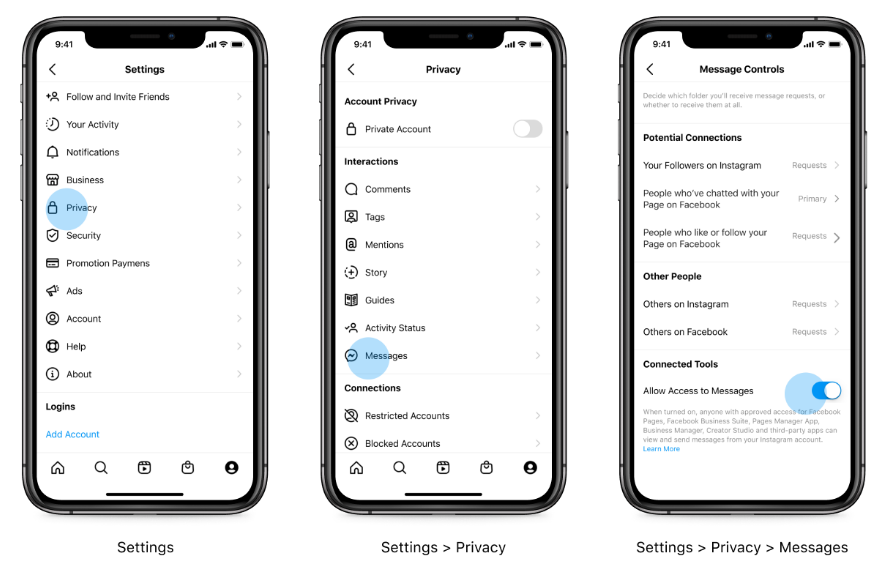
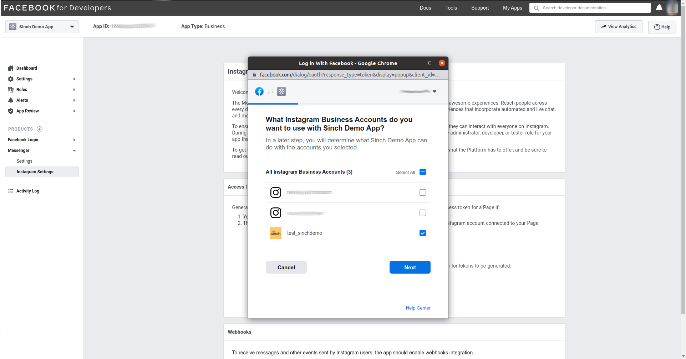
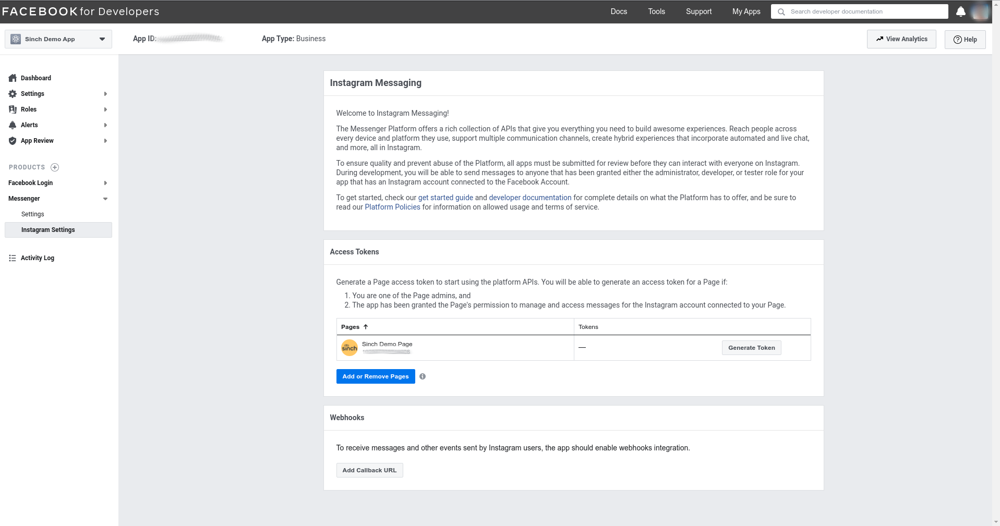

Before you start sending messages using the Instagram Messaging API, you will need access to the following:

* An Instagram business account, that will receive and send messages
* A Facebook page connected with that account
* A Facebook developer account that can perform tasks on that page
* A registered Facebook App with basic settings configured
* An Instagram Authentication Token

### Creating an Instagram Business Account

On Instagram, you can convert your personal profile to a business account or create a new one following
this [guide](https://www.facebook.com/business/help/502981923235522).

Only business accounts can send and receive messages using the Conversation API Instagram integration.

> 📘 If you already have an Instagram business Account your can skip this step.

### Creating a Facebook Page

In order to send and receive message using the Instagram Message API, you need a Facebook Page connected
to your Instagram business account. You can learn how to create a Facebook
page [here](https://www.facebook.com/business/help/104002523024878).

> 📘 If you already have a Facebook Page your can skip this step.

### Creating a Facebook App

In order to set up the Instagram Messaging API, you should create a Facebook App, following
this [guide](https://developers.facebook.com/docs/development/create-an-app/).

> 📘 If you already have a Facebook App your can skip this step.

> 🚧 By now, Instagram Messaging Product is allowed as a Closed Beta integration, so, in order to add
> the Instagram Messaging product to your Facebook App, you should contact us.

### Connecting the Facebook Page to the Instagram Business Account

* Access the settings sections of your Facebook Page

* Access the Instagram section

* Click "Connect button" and login to you Instagram business Account

* Now your Instagram account is connected to your Facebook Page.

### Enabling Connected Tools in Instagram Business Account

In order to send messages using the Instagram API you should enable connected tools in the Instagram business account,
just follow these steps:

### Generating the Instagram Access Token

* Access "developers.facebook.com" and select your App.

* Click "Add or Remove Pages" and select your Instagram Business Account and your Facebook Page.

* Now you can visualize all the Facebook Pages that are connected to your Facebook App.

* Click "Generate Token" to generate an Instagram Access Token to the Facebook Page connected to an Instagram Business
  Account that you want to send and receive messages using an API.

Now you can use the generated Instagram Access Token
to [set up your Conversation API Instagram integration](doc:conversation-instagram).